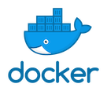

## Amazon SageMaker Delta Sharing Examples
   

This repository contains examples and related resources showing you how to preprocess, train, and serve your models using Amazon SageMaker with data fetched from [Delta Lake](https://github.com/delta-io/delta-sharing). 

### Repository Structure

The repository contains the following resources:

- **scikit-learn resources:**  

  - [**Delta Lake scikit-learn Script Mode Training and Serving**](delta_lake_scikit_learn_training_and_serving):  This example shows how to train a scikit-learn model on the boston-housing dataset fetched from Delta Lake, and then serve your model with scikit-learn and SageMaker script mode.
  - [**Delta Lake Bring Your Own Container Processing Job**](delta_lake_bring_your_own_container_processing):  This example provides a detailed walk-through on how to package a scikit-learn Docker image for processing job that fetch data from a table on Delta Lake, and aggregate total COVID-19 cases per country. 
    
<b>Those notebooks were tested on SageMaker Studio with Python 3 (Data Science) Kernel.</b>

## Questions?

Please contact [@e_sela](https://twitter.com/e_sela) or raise an issue on this repo.

## License

This library is licensed under the MIT-0 License. See the LICENSE file.